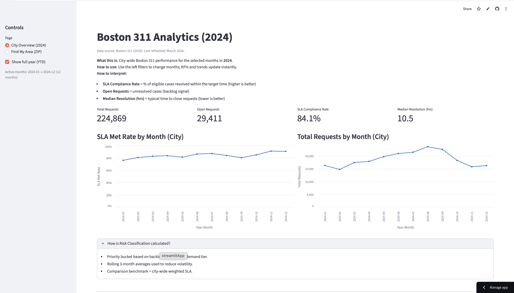
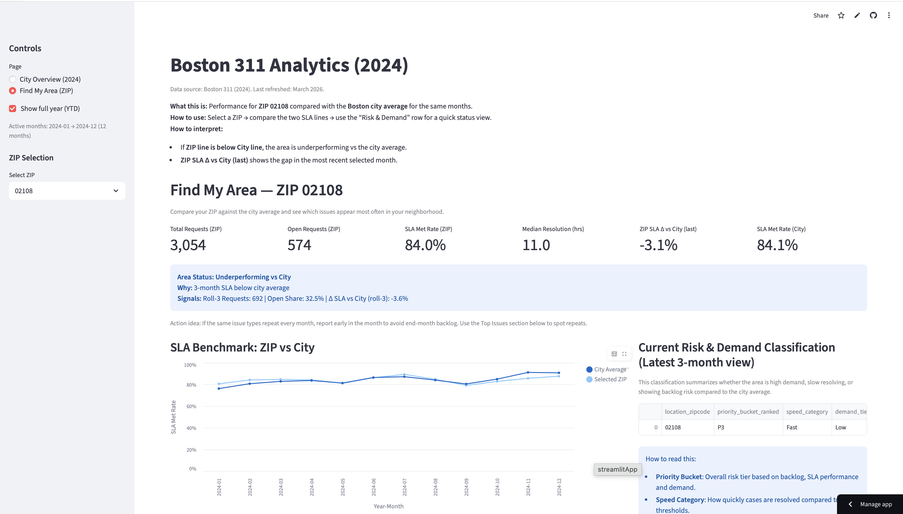
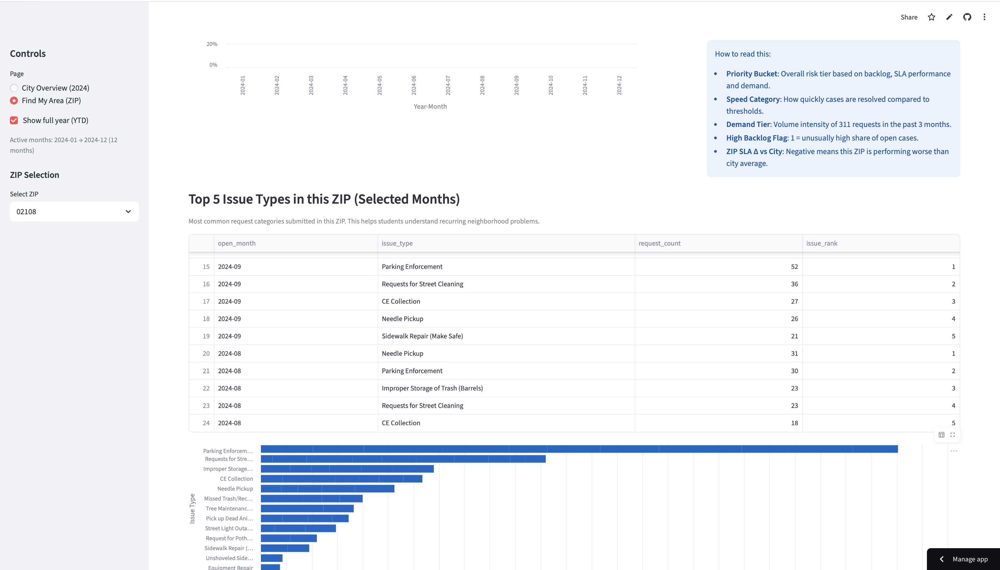
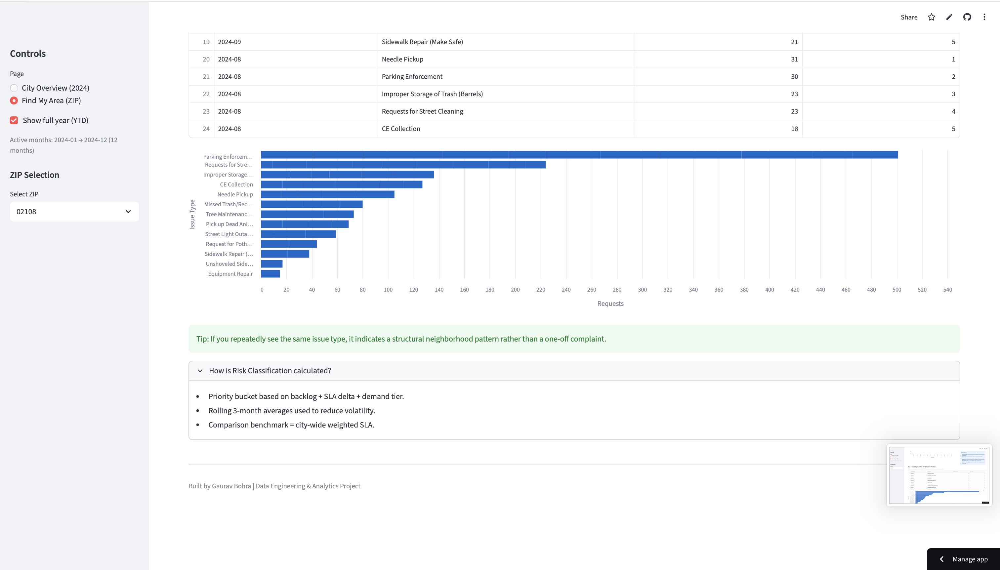
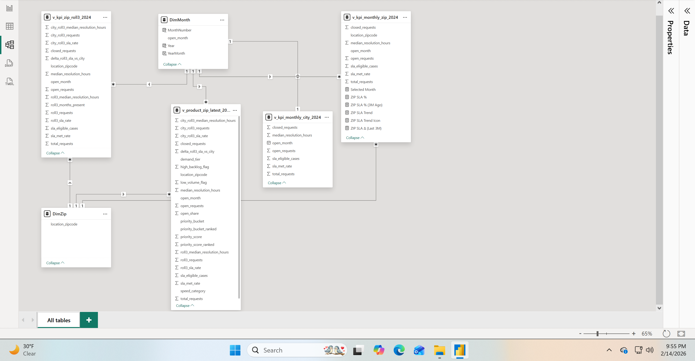
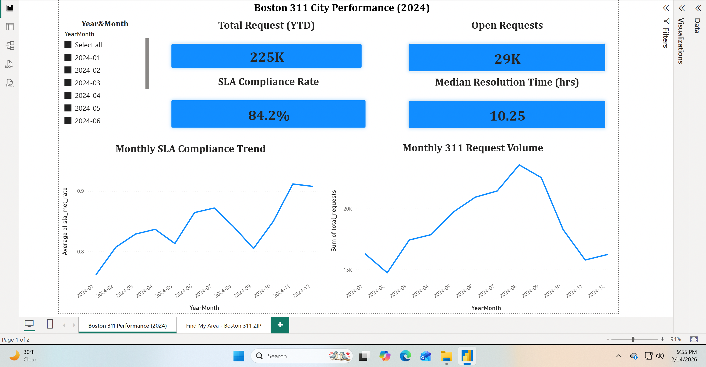
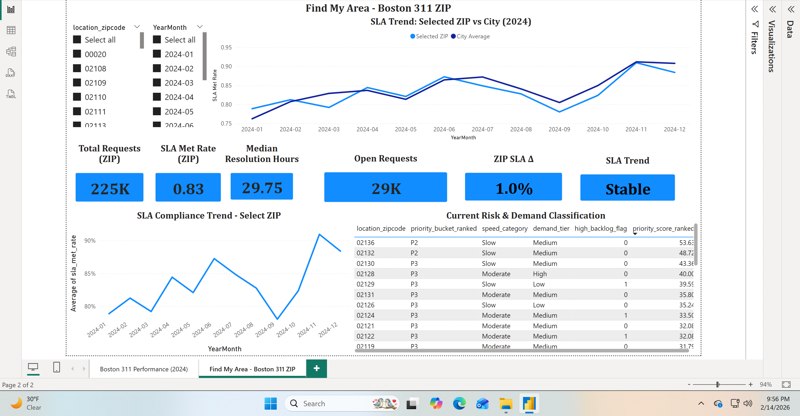

# Boston 311 Analytics (2024)

Production-style analytics system for analyzing Boston 311 service performance in 2024.

**Pipeline:** data extraction → transformation → warehouse modeling → analytical views → semantic modeling → hosted application → usage logging

**[Live Application](https://boston311-analytics-o6zfms45ffeyrhnsxxdyds.streamlit.app)**

## Screenshots

### City Overview


### Find My Area – View 1


### Find My Area – View 2


### Find My Area – View 3


---

### Power BI Semantic Model


### Power BI Dashboard




## Problem

City 311 data is large, messy, and difficult to interpret at scale. This system answers:
- How many requests were opened vs closed each month?
- What is the SLA compliance rate?
- What is the median resolution time?
- How does a ZIP compare to the city average?
- Is backlog increasing or shrinking?

Instead of building a static dashboard, this project builds a query-driven analytics layer backed by PostgreSQL.

## System Architecture
```
Data Source → Python Cleaning → PostgreSQL (Supabase) → Analytical Views 
→ Semantic Model (Power BI) → Streamlit Application → Streamlit Cloud
```

## Tech Stack

- **Python (pandas)** — data cleaning
- **PostgreSQL (Supabase)** — warehouse
- **SQL views** — analytical layer
- **Power BI** — semantic modeling
- **Streamlit** — application layer
- **Streamlit Cloud** — deployment
- **UUID-based session logging** — usage tracking

## Core Engineering Decisions

- Built analytical SQL views instead of querying raw tables
- Hosted on Supabase (production-grade PostgreSQL)
- Implemented session-based logging (avoids Streamlit rerun inflation)
- Managed secrets via Streamlit Cloud (no credentials in repo)
- Normalized and validated ZIP codes
- Separated raw data, analytical layer, and application layer

## Scale

- ~17k+ service request records (2024)
- 12-month aggregation layer
- ZIP-level breakdown
- Hosted Postgres-backed analytics
- Live session tracking

## Key Features

- City-wide KPI dashboard
- ZIP-level comparison vs city averages
- SLA compliance calculation logic
- Median resolution time calculation
- Page-level logging + unique session tracking

## What This Project Demonstrates

- Real-world data cleaning under messy conditions
- Warehouse modeling in PostgreSQL
- Analytical SQL design
- Deployment debugging (Supabase + Streamlit)
- Logging architecture in reactive frameworks
- Iterative engineering problem solving

## Run locally
```bash
python -m venv .venv
source .venv/bin/activate
pip install -r app/requirements.txt
streamlit run app/app.py
```
## Deployment Notes

- Requires PostgreSQL views to be created (see /sql and /sql/views)
- Database hosted on Supabase
- Secrets managed via Streamlit Cloud
- No credentials stored in repository

## Documentation

- [Architecture](ARCHITECTURE.md)
- [Security](SECURITY.md)
- [Changelog](CHANGELOG.md)
- [Power BI Semantic Model Details](SEMANTIC_MODEL.md)